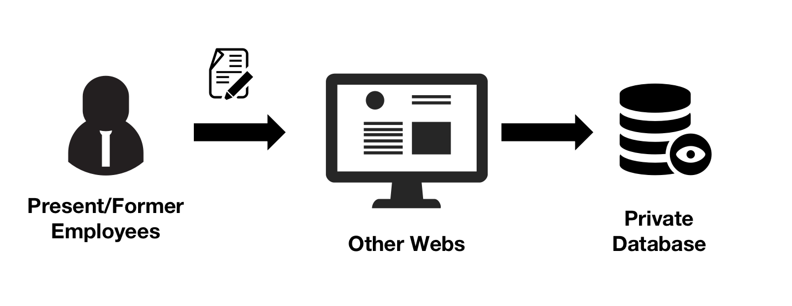
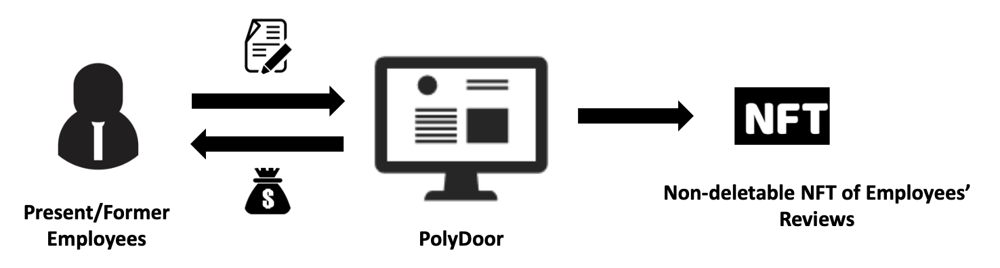
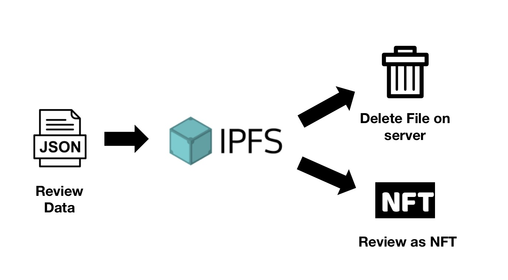
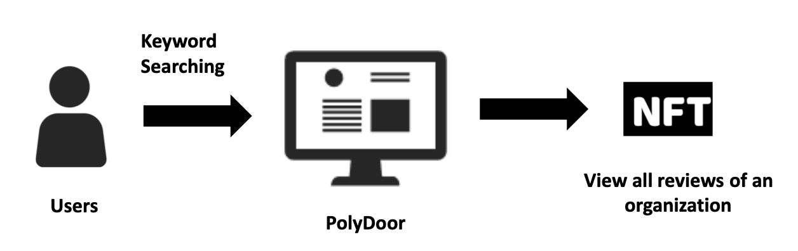

# PolyDoor
Our project is a website which allows viewers (jobseekers) to view the comments to companies, which are posted by anonymous commenters previously or currently working for the companies. 

## Motivations

Traditionally, other workplace commenting websites operate on their private servers. 

### However 
* Unsafe for commenters, since uploads traceable
* Companies can pay to delete comments
* Vulnerable to attacks

### Why use NFT and blockchain?
- Our model is based on anonymous posts
- NFT can take different forms, flexibility allow comments to be minted as NFT
- Once the NFT comments are uploaded to blockchain, they cannot be deleted 
- The NFT comments can be re-minted for wider distributions

## Working principle
In return, users can get ERC20.

The comments will be uploaded to the blockchain as NFTs, minted by our Smart Contract.

### Commenter interaction

Commenters will be commenting their companies or their former companies on our website. The comments are in the following categories,
- Culture
- Diversity
- Work Life Balance
- Management
- Salary Benefits
- Promotion opportunities
- Overall
- Reviews

In return, user commenters get ERC20 coins as a reward.

### NFT minting

After receiving the comments, comments will be complied into json strings, which will be minted into NFTs and uploaded to blockchain. The local json data will be deleted, once the NFT is minted and uploaded.

### Viewers interaction

The viewers will be reading the comments to companies by searching through key work. The smart contract wil return the NFT related to the companies through filtering with the keyword. 

The downloaded NFTs will be analyzed locally, and the ratings and the comments will be presented to the viewers.
